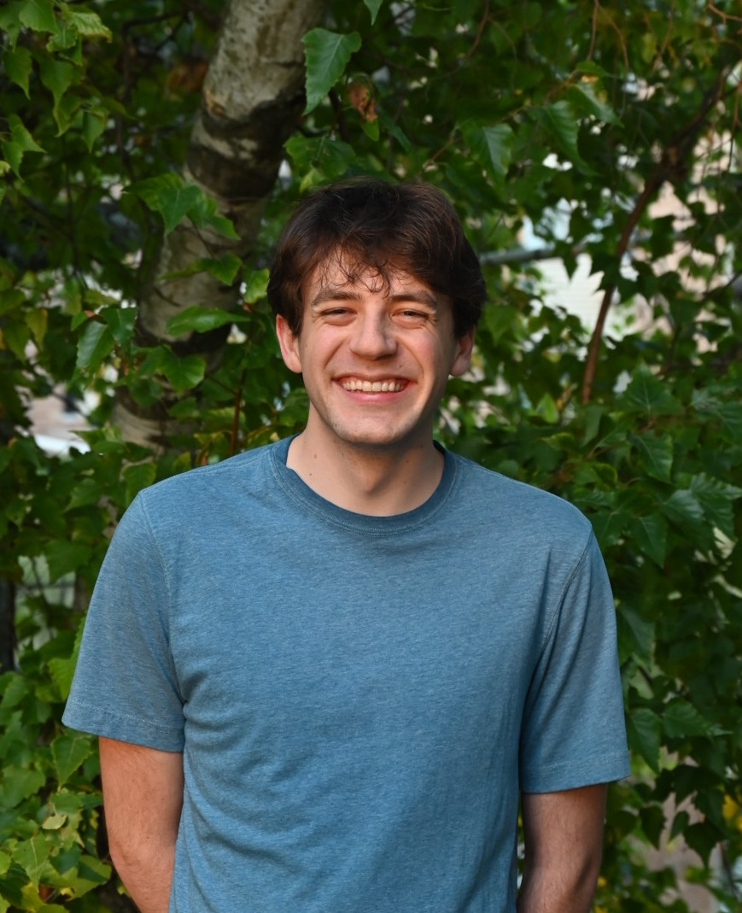

:::: {.columns}

::: {.column width="30%"}
{width=200px style="border-radius: 50%;"}
:::

::: {.column width="70%"}
## About Me

Hi! I'm **Lucas Mansfield**, and I'm an ecologist with interests in birds, ecological communities, spatial analyses, and global change ecology. 

I'm currently a PhD student at **Michigan State University** in the Department of Integrative Biology and Ecology, Evolution, and Behavior program as a part of the [Spatial and Community Ecology (SpaCE) Lab](https://www.communityecologylab.com/).

My current work focuses on species interaction networks, and understanding the drivers of ecological network change across temporal and spatial scales in North America. To do this, I am leveraging data on species interactions, species occurrences, land cover change, and climate.

### Contact

- [mansfi79@msu.edu](mailto:mansfi79@msu.edu)
- [GitHub](https://github.com/lmansf44)
:::

::::
