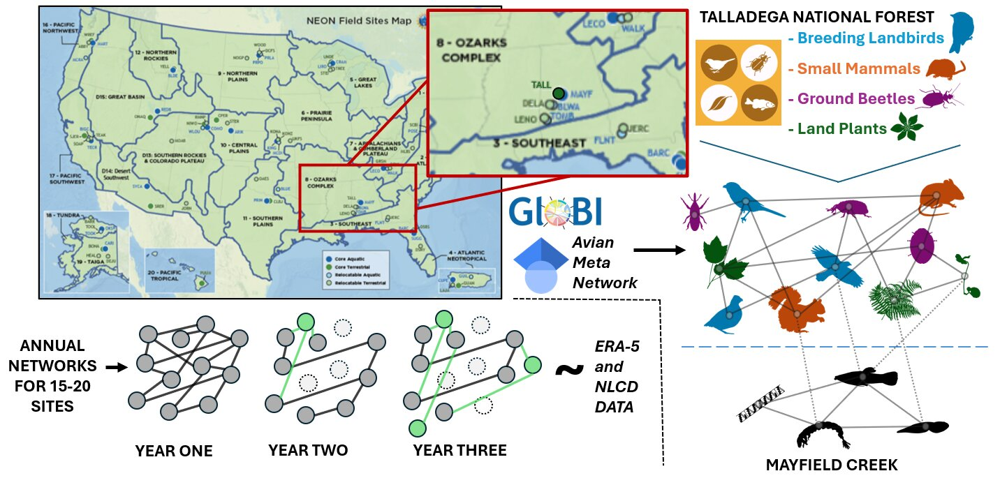

## Current Projects

## The AvianMetaNetwork {style="text-align: center;"}

::::::: columns
:::: {.column width="60%"}
::: {style="text-align: left;"}
Species interactions are a crucial aspect of ecosystem functioning and biodiversity, yet we lack comprehensive information on interactions at broad scales. **The AvianMetaNetwork** is a comprehensive database of bird-bird species interactions that attempts to fill this knowledge gap and enable research that answers macroecological and eco-evolutionary questions about species interactions. The database is built by undergraduates in the SpaCE lab through systematic literature review! Currently, the database is complete for North America (Canada, Alaska and the conterminous United States).

[Project Website](https://avianmetanetwork.github.io/)\
[Project Github](https://github.com/AvianMetaNetwork/AvianMetaNetwork)

*Paper:*\
**The AvianMetaNetwork: biotic interactions among birds of the continental United States and Canada** (In preparation)\
Zarnetske, P., Bills, P., Kapsar, K., **Mansfield, L.**, Parker, E., Roche, C., Hirschowitz, I., DePasquale, G., & Zonneveld, S.\
:::
::::

:::: {.column width="40%"}
::: {style="text-align: center;"}
{width="400px" height="200px"} 
[Example network generated from the AvianMetaWeb.]{.fig-caption}
:::
::::
:::::::

------------------------------------------------------------------------

## Disturbance and Climate on Species Networks at NEON Sites {style="text-align: center;"}

::::::: columns
:::: {.column width = "50%"}
::: {style="text-align: left;"}
This project leverages data from the [National Ecological Observatory Network (NEON)](https://www.neonscience.org/) to study the impacts of anthropogenic disturbance and climate change across the United States. Terrestrial NEON sites contain annually sampled data on breeding birds, ground beetles, plants an small mammals, which is used to produce a taxa list. This is supplemented with interaction data from sources such as the **AvianMetaNetwork** and [Global Biotic Interactions (GloBI)](https://www.globalbioticinteractions.org/) to build species interaction networks. Using rasters of land cover change and climate, I am exploring the factors that cause interaction network strucutre change across space and time.

:::
::::
:::: {.column width="50%"}
::: {style="text-align: center;"}
{width="100%" height="200px"} 
[Workflow for network analysis at one terrestrial NEON site: Talladega Forest.]{.fig-caption}
:::
::::
:::::::
------------------------------------------------------------------------

## Past Projects

## Green Hermit Sexual Dimorphism {style="text-align: center;"}

::::::: columns
:::: {.column width="60%"}
::: {style="text-align: left;"}
Green Hermits (*Phaethornis guy*) are tropical species of hummingbirds that engage in aggressive leks during the breeding season. This species is also notable for its bill sexual dimorphism, in which females have visibly curvier bills than males. Using 3D bill models generated from museum specimens using photogrammetry, we showed that male bills are significantly straighter, stronger and sharper than female bills, indicating the sexual dimorphism might benefit male green hermits who spar with their bills during intense leks.

*Press:*\
[Scientific American](https://www.scientificamerican.com/article/videos-show-hummingbirds-jousting-like-medieval-knights-in-rare-mating/)\
[Smithsonian Magazine](https://www.smithsonianmag.com/smart-news/these-male-hummingbirds-evolved-straighter-sharper-bills-so-they-could-better-joust-for-mates-180987883/)\
[UW News](https://www.washington.edu/news/2025/11/21/sharper-straighter-stiffer-stronger-male-green-hermit-hummingbirds-have-bills-evolved-for-fighting/)\
[Inside JEB](https://journals.biologists.com/jeb/article/228/21/jeb251783/369729/Sharper-straighter-bills-give-male-green-hermits)

*Paper:*\
**Sharper, straighter, stiffer, stronger: sexually dimorphic bill shape enhances male stabbing performance in the green hermit hummingbird (Phaethornis guy)** (2025)  
Garzón-Agudelo, F., **Mansfield, L.**, Epperly, K., Rico-Guevara, A. 
*Journal of Experimental Biology*, 228(21), pages.  
[[PDF]](#) [[DOI]](https://doi.org/10.1242/jeb.250769)
:::
::::

:::: {.column width="40%"}
::: {style="text-align: center;"}
{width="100%"} 
[Graphical abstract of hermit bill measurements.]{.fig-caption}
{fig-align="center" width="75%"}\
[Cover of JEB issue with photo by Jan Lenaert!]{.fig-caption}

:::
::::
:::::::

------------------------------------------------------------------------

## Rainforest Remote Sensing and Tree Emergence {style="text-align: center;"}

::::::: columns
:::: {.column width="60%"}
::: {style="text-align: left;"}

:::
::::

:::: {.column width="40%"}
::: {style="text-align: center;"}

:::
::::

------------------------------------------------------------------------

## PicoCam: Photogrammetry {style="text-align: center;"}

::::::: columns
:::: {.column width="60%"}
::: {style="text-align: left;"}

:::
::::

:::: {.column width="40%"}
::: {style="text-align: center;"}

:::
::::